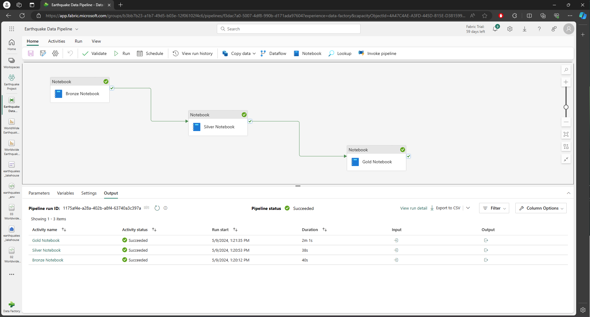
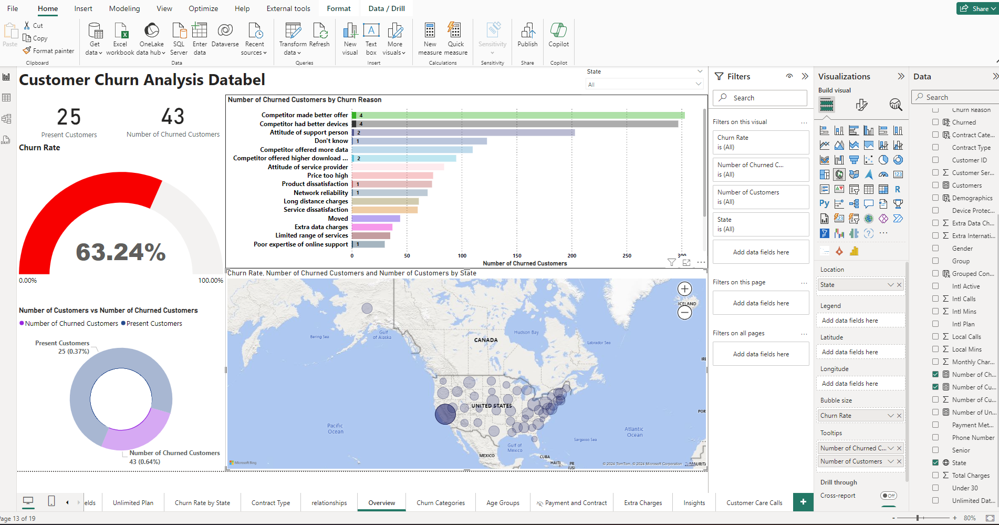
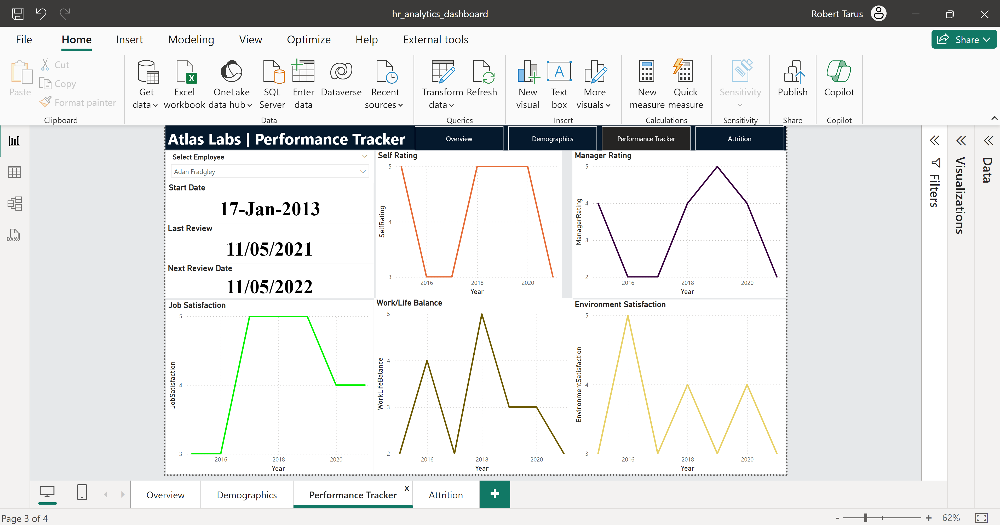

# Tarus Portfolio
<table>
  <tr>
    <td>
      <h1>Tarus Portfolio</h1>
      <h2>Data Engineer</h2>
      
Technical Skills: Power BI, SQL, Microsoft Fabric, Python

    </td>
    <td>
      
    </td>
  </tr>
</table>

### Technical Skills: Power BI, SQL, Microsoft Fabric, Python

Welcome to my data portfolio! Here, I document a summary of my projects in the data field.

## About Me
Throughout my career, I have consistently delivered results that have positively impacted the organizations I have worked for. I have conducted comprehensive spend analysis, implemented compliance reporting mechanisms, and developed Key Performance Indicators (KPIs) to monitor and evaluate supply chain performance.
I possess proficiency in statistical modeling, data visualization, and dashboard development, leveraging tools such as Python, SQL, Excel and Power BI to derive actionable insights from complex datasets. My analytical mindset enables me to identify trends, forecast future outcomes, and develop strategic recommendations to support organizational goals.

Key Skills:

- Supply Chain Data Analysis
- Spend Analysis
- Process Improvement
- Statistical Modelling (Price Trend Forecasting)
- Project Management
- Collaboration and Stakeholder Engagement
- Business Acumen
- Compliance Reporting

## Technical Skills

## 📚 Table of Contents
- [Data Engineering](#data-engineering)
- [SQL](#sql)
- [Python](#python)
- [Power BI](#power-bi)
- [Contact](#contact)

## Data Engineering

| Project Link | Completion Date | Tools | Project Description | 
|--------------|-----------------|-------|---------------------|
| [End-to-End ETL Tracking Daily Seismic Events]() | May 2024 | Python, Microsoft Fabric, Power BI | Developed and implemented an end-to-end ETL pipeline for capturing earthquake activities around the world daily. The pipeline leverages the 'requests' module in Python to pull real-time earthquake data from the USGS API in JSON format, ensuring a continuous influx of up-to-date information. This raw data forms the foundation of our data pipeline, capturing historical records of seismic events worldwide. In the silver layer, we reshape and rename the raw data into columns to improve its quality and consistency, laying the groundwork for further analysis. In the gold layer, we import the refined data into Power BI, creating a semantic model optimized for analysis and visualization. This dataset serves as the gold standard for insights generation, providing actionable information on seismic activity worldwide. The Power BI report, using the gold layer data, offers real-time updates on seismic activities worldwide. Users can effortlessly explore the data and gain valuable insights into ongoing seismic trends. To ensure the report remains current, a scheduled data refresh mechanism is created that can pull and update new data daily. Additionally, users can still utilize the SQL analytics endpoint to access and retrieve the data for further analysis. |

## Key Insights from Seismic Events Dashboard
- **Real-time Data:** Continuously updated with the latest seismic activities.
- **Global Coverage:** Comprehensive view of seismic activities worldwide.
- **User-friendly Interface:** Easy to navigate and extract insights.

***

## SQL

| Project Link | Area of Analysis | Project Description | 
|--------------|------------------|---------------------|
| [Toronto Bikeshare Ridership 2023](https://github.com/RobertTarus/Bienvenue/blob/main/Bikeshare_SQL_Solutions) | Bikeshare Analysis | Created a semantic model and answered key questions regarding Toronto Bikeshare ridership for 2023, gaining insights into the busiest stations and showcasing how weather affects the number of cyclists using the bikeshare service. This project demonstrates my proficiency in SQL query writing and problem-solving skills. |

***

## Python

| Project Link | Area | Project Description | Libraries | Key Insights |
|--------------|------|---------------------|-----------|--------------|
| [Toronto Bikeshare Ridership Data Cleaning and Integration](https://github.com/RobertTarus/Bienvenue/blob/main/toronto-bikeshare-dataset-cleaning-and-using-joins.ipynb) | Data Wrangling and EDA | Cleaned the dataset and integrated it with weather data to gain insights on the impact of weather on bikeshare rides throughout the year. | Pandas, NumPy, Matplotlib | - **Busiest Stations**: Identified top stations and peak usage times. - **Weather Impact**: Analyzed correlation between weather and ridership. - **User Demographics**: Insights on age and gender distribution. - **Operational Insights**: Suggested improvements for bike distribution. - **Proficiency**: Demonstrated advanced SQL skills and problem-solving. |
| [Canada Food Prices Analysis 2017-2023](https://www.kaggle.com/code/roberttarus/canada-food-prices-analysis-2017-to-2023) | Data Wrangling & EDA | Analyzed food prices data from 2017 to 2023 to investigate price trends of food products and the impact of COVID-19 and inflation on food prices in various provinces in Canada. | Pandas, Matplotlib, NumPy | - **Price Trends**: Identified significant trends in food prices over the years. - **Impact of COVID-19**: Analyzed how the pandemic affected food prices. - **Inflation Impact**: Assessed the influence of inflation on food costs. - **Regional Differences**: Highlighted price variations across different provinces. - **Data Visualization**: Utilized Matplotlib for effective visual representation of findings. |

***

## Power BI

| Project Link | Project Description | Dashboard Link |
|--------------|---------------------|----------------|
| [Customer Churn Analysis]() | Visualized key insights into reasons why customers were quitting a service using Power BI, including the demographic of churners. | [Dashboard]() |

| Project Link | Project Description | Dashboard Link |
|--------------|---------------------|----------------|
| [HR Analytics and Performance Tracker](https://www.linkedin.com/in/roberttarus/details/projects/?profileUrn=urn%3Ali%3Afsd_profile%3AACoAABxHwrABKJplDw_-Fg9iG7dIKXSF8eQYQfI) | The report is divided into four parts: 1. Overview - The first dashboard shows the number of active employees in the company per department and the number of new hires versus people who left the job.2. Demographics - Employee demographics based on age, gender, salary, ethnicity, and marital status3. Performance Tracker - Breakdown of each employee performance of based on their own rating, the manager's rating, work/life balance, job satisfaction. 4. Breakdown of attrition rate based on frequency of travel, work tenure, over time, and job role. | [Dashboard](https://www.linkedin.com/in/roberttarus/details/projects/?profileUrn=urn%3Ali%3Afsd_profile%3AACoAABxHwrABKJplDw_-Fg9iG7dIKXSF8eQYQfI) |

***

## Contact

Feel free to reach out via [LinkedIn](https://www.linkedin.com/in/roberttarus) or [Email](mailto:tarusrobertkiprotich@gmail.com) for collaborations or any questions about my projects.

## Personal Interests

When I'm not diving into data, I enjoy contributing to open-source projects, participating in data science hackathons, and staying updated with the latest trends in the tech industry. In my free time, I love watching Formula One and Manchester United.

